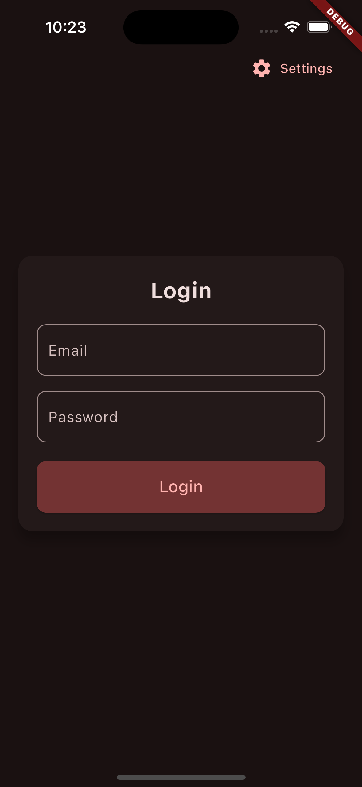
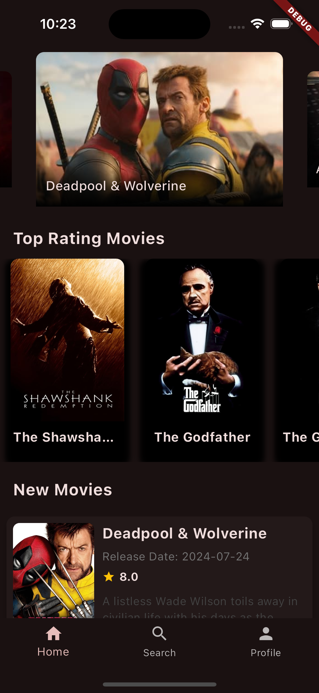
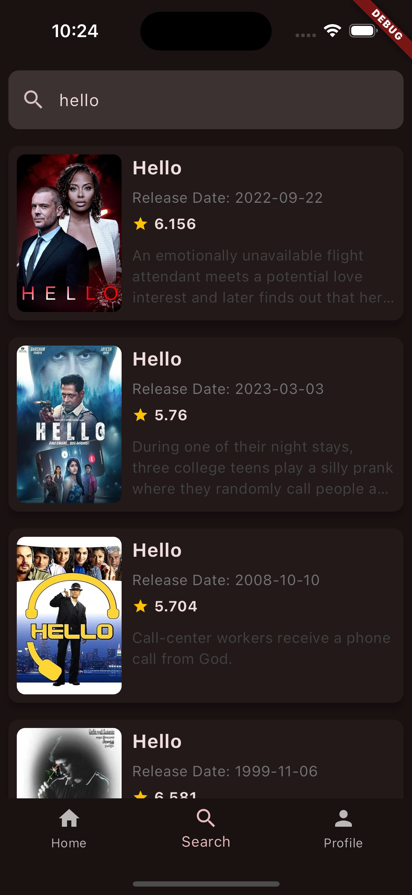
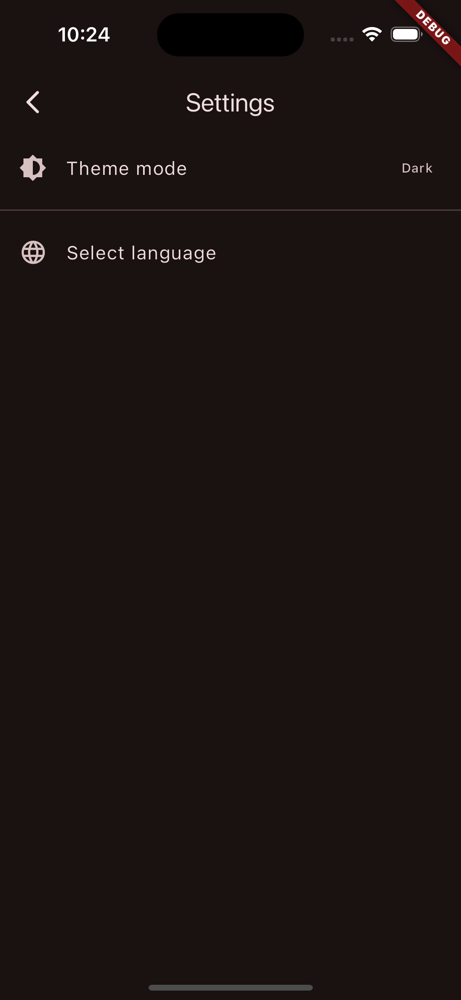

# FlutterRiverpodBase

A Flutter project base using Riverpod and apply Clean Architecture pattern

## Some screen shots

<p align="center">
 
  
  
  
</p>

## Tech Stack

- State Management: [Riverpod-hooks](https://riverpod.dev/)
- Navigation: [GoRoute](https://pub.dev/documentation/go_router/latest/)
- Screen responsive: [ResponsiveFramework](https://pub.dev/packages/responsive_framework)
- Localization: [EasyLocalization](https://pub.dev/packages/easy_localization)
- Network:
  - [Dio](https://pub.dev/packages/dio)
  - [Retrofit](https://pub.dev/packages/retrofit)
- Lightweight local storages:
  - [SharedPreferences](https://pub.dev/packages/shared_preferences)
  - [SecureStorage](https://pub.dev/packages/flutter_secure_storage)

## Features:

- Login
- View Home(now playing carousel, popular list, up coming movies)
- Search Movies
- View Movie Detail
- Profile
- Setting(theme, language)

## Installation

Clone this repository

```bash
git@github.com:nhatpv-1627/flutter_riverpod_base.git
```

Install Pub

```bash
flutter clean
flutter pub get
```

Run command to run code generator for your assets, fonts, colors... by `FlutterGen`

```bash
dart run build_runner build --delete-conflicting-outputs
```

Run command to add file `locale_keys.g.dart`, this file support for library `easy_localization`

```bash
flutter pub run easy_localization:generate -S assets/translations -f keys -o locale_keys.g.dart
```

## Run & Build debug tabs with environment

- develop
- staging
- production

## Run in terminal at root folder

```bash
flutter run --flavor <flavor> --dart-define=environmentName=<flavor>
```

Example run develop

```bash
flutter run --flavor develop --dart-define=environmentName=develop
```

## Note: With Android Studio need to implement Flavor in Flutter

- Open Android Studio redirect to `FlutterBase` project folder.
- Step 1, 2: Select `Run/Debug Configuration` -> `Edit Configurations...`
  

- Step 3, 4: On new window `Run/Debug Configuration` -> select `+` -> choose `Flutter`
  

- Step 5: Create 3 new configurations `develop`, `staging`, `production`. Fill `Additional run args` respectively:

```bash
--flavor develop --dart-define=environmentName=develop
--flavor staging --dart-define=environmentName=staging
--flavor production --dart-define=environmentName=production
```


## Credits

- [TheMovieDB](https://developer.themoviedb.org/v4/reference)

### Run and try. Happy coding <3
